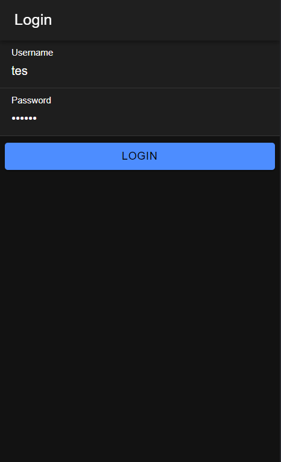
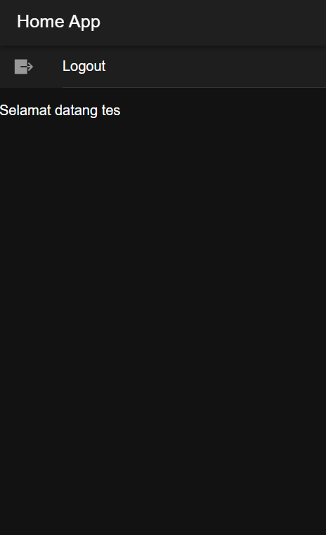

# Tugas 7 Pertemuan 8

Pertama di halaman login. Isi username dan password kemudian klik login. Aplikasi akan mengirim data ke API, diatur dari file login.page.ts yang juga menggunakan fungsi autentikasi dari authentication.service.ts kemudian dicek apakah ada username dan password yang sesuai di database. Kalau berhasil akan dialihkan ke home serta menyimpan token session dan username. 

Tampilan home. Ada 2 guard. Pertama adalah auth.guard.ts yang mencegah orang belum login untuk ke home dan auto-login.guard.ts yang mencegah orang sudah login ke halaman login. Ada tombol logout untuk logout yang termasuk fungsi dalam authentication.service.ts

